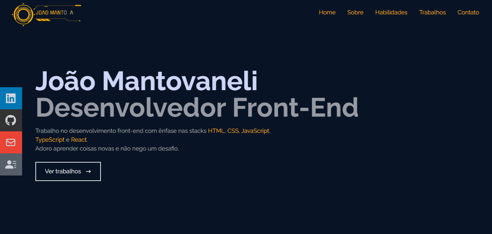
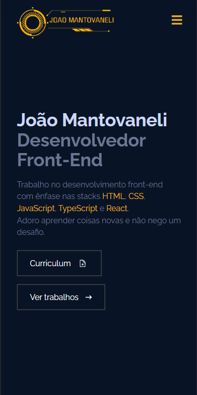

<h1 align="center">Portfólio Web App</h1>

O projeto consiste em um portfólio web SPA responsivo.   

  <a href="#-tecnologias">Tecnologias</a>&nbsp;&nbsp;&nbsp;|&nbsp;&nbsp;&nbsp;
  <a href="#-projeto">Projeto</a>&nbsp;&nbsp;&nbsp;|&nbsp;&nbsp;&nbsp;
  <a href="#-layout">Layout</a>&nbsp;&nbsp;&nbsp;|&nbsp;&nbsp;&nbsp;
  <a href="#memo-licença">Licença</a>

  

 

  

  

## 🚀 Tecnologias

Esse projeto foi desenvolvido com as seguintes tecnologias:

- HTML e CSS
- [Tailwind CSS](https://tailwindcss.com/)
- JavaScript e React
- [Node e NPM](https://nodejs.org/)

## 💻 Projeto

Este portfólio foi construido usando o React e a estilização com Tailwind CSS, projetado de forma responsiva, fornece as abas Home, Sobre, Habilidades, Trabalhos e Contato que direcionam o usuário a devida seção da página ao serem clicadas. Na versão mobile ou em telas menores, a lista de items da lugar a um menu hamburguer, que quando acionado mostra as opções de navegação em tela cheia para maior acessibilidade. Na versão web há um menu lateral de acesso rápido aos botões LinkedIn, GitHub, E-Mail e Curriculum que ao passar o mouse expander e possibilitam o redirecionamento para a opção clicada, além de serem fixos e acompanharem o scroll por todas seções, na versão mobile/telas pequenas o menu lateral se esconde para dar espaço as informações das seções.
Na página Home, temos uma breve introdução e um botão "Ver trabalhos" que ao ser clicado direciona o usuário a seção de Trabalhos de forma mais direta, esta por sua vez exibe em cards imagens dos trabalhos/projetos realizados, quando se passa o mouse por cima os cards exibem uma breve descrição do projeto com dois botões para vizualizar uma demonstração e ir para o código do projeto no GitHub. A versão mobile da página Home possui um segundo botão chamado "Curriculum", visando o rápido acesso ao curriculum, uma vez que o menu lateral não esta presente nessa versão.
As páginas Sobre e Habilidades mostram um resumo profissional e as habilidades(stacks) já trabalhadas, respectivamente. Por final a aba Contato possui um botão para comunicação rápida através do WhatsApp e um formulário para contato que pode ser preenchido e enviado, o mesmo encaminha um e-mail através da plataforma [getform.io](https://getform.io/) com as informações preenchidas pelo usuário.

## :memo: Licença

Esse projeto está sob a licença MIT.

---
